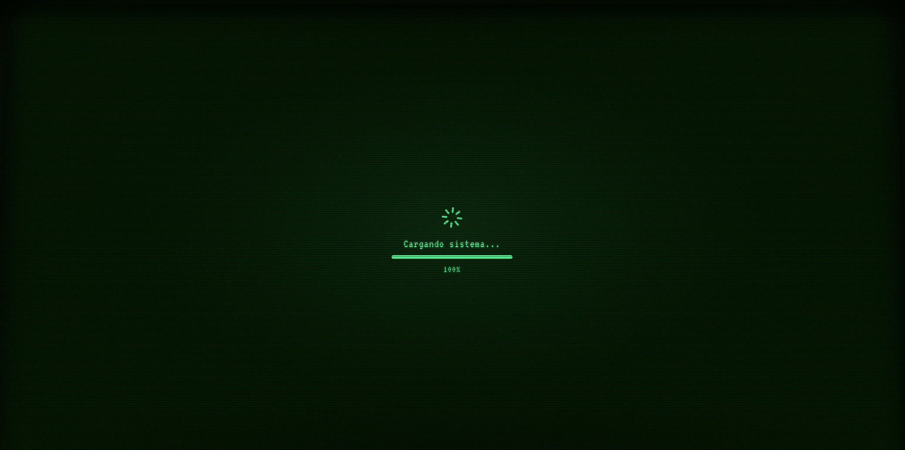

<h1 align="center">Wallbit Junior Frontend Challenge</h1>

### 🏠 [Preview](https://el-topo.emirchus.ar/)

## 📝 Tabla de contenidos

- [🧐 Acerca del proyecto](#-acerca-del-proyecto)
- [🚀 Comenzando](#-comenzando)
  - [📋 Prerequisitos](#-prerequisitos)
  - [📦 Instalación](#-instalación)
- [🚀 Deployment](#-deployment)
- [🌟 Dependencias](#-dependencias)
## 🧐 Acerca del proyecto

> Proyecto de frontend para el desafío de Wallbit Junior Frontend Challenge. El proyecto consiste en un carrito de compras con las siguientes funcionalidades:
- Añadir productos al carrito.
- Eliminar productos del carrito.
- Modificar la cantidad de productos en el carrito.
- Ver el total de la compra.
- Imprimir Ticket


> Splash screen


> Inicio


> Carga de productos


> Recibo


> ?
## 🚀 Comenzando

### 📋 Prerequisitos

- Node.js [https://nodejs.org/](https://nodejs.org/) (20.18.0)
- NVM [https://github.com/nvm-sh/nvm](https://github.com/nvm-sh/nvm) (opcional)
- pnpm [https://pnpm.io/es/installation](https://pnpm.io/es/installation)
- Git [https://git-scm.com/](https://git-scm.com/)
- Visual Studio Code [https://code.visualstudio.com/](https://code.visualstudio.com/)

### 📦 Instalación

Después de descargar e instalar [Node.js](https://nodejs.org/), ejecutar los siguientes comandos:

```sh
npm install -g pnpm
```

Y después clonar el repositorio:

```sh
git clone https://github.com/emirchus/wallbit-challenge
```

```sh
cd wallbit-challenge
```

Después de clonar el repositorio, instalar las dependencias y ejecutar el proyecto en dev con los siguientes comandos:

```sh
pnpm install
```

```sh
pnpm dev
```

### 🚀 Deployment

```sh
pnpm build
```

## 🌟 Dependencias

- ⚛️ react - Biblioteca de JavaScript para construir interfaces de usuario.
- 🎨 tailwindcss - Biblioteca de utilidades de CSS de bajo nivel.
- 🎨 @radix-ui - Framework para diseño responsivo y estilización de componentes UI.
- 📦 pnpm - Gestor de paquetes.
- 📦 vite - Herramienta de desarrollo web.
